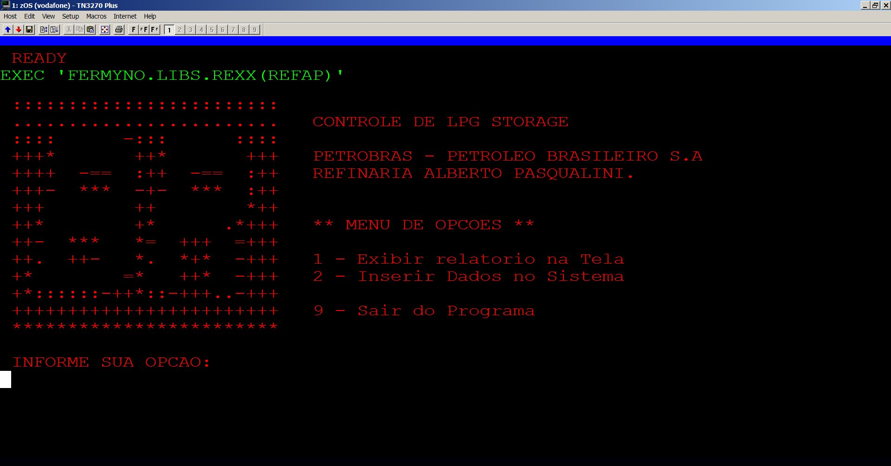
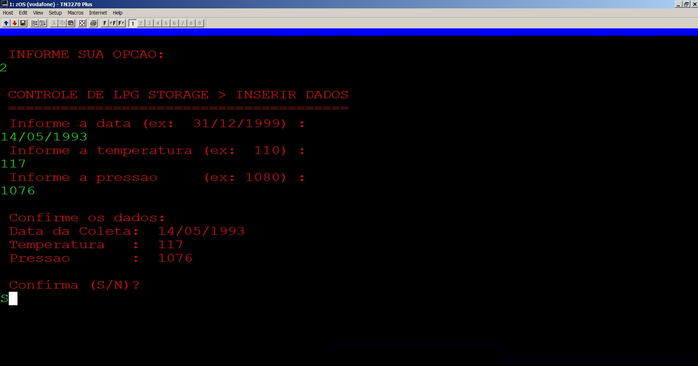

# Sistema de Controle de Medições Industriais (LPG STORAGE)

Sistema de Controle de Medições Industriais, desenvolvido em linguagem REXX, em ambiente mainframe, como requisito para a conclusão do estágio na REFAP - Refinaria Alberto Pasqualini (PETROBRÁS - Petróleo Brasileiro S.A.).
 

> **Warning**
> 
> [DEPRECATED]  
> Os arquivos estão mantidos neste repositório apenas para fins de demonstração e documentação. 

# REXX LPG STORAGE:

Desenvolvimento de um programa para o cadastro das medições realizadas nos tanques de Gás liquefeito de petróleo (LPG STORAGE). 
O objetivo era implementar um programa para permitir o arquivamento das medições realizadas nos tanques da refinaria, uma vez que os processos industriais exigem um controle permanente de variáveis, tais como: pressão, temperatura, nível, pH, vazão, entre outros.  

Cabe ressaltar que, naquela época, não havia Telemetria e as medições eram realizadas manualmente, in situ, com apontamentos em papel. Com a utilização do programa, a impressão de arquivo texto com os gráficos de medições realizados pelo programa foi considerado um grande avanço pelos profissionais do setor.

**Desenvolvimento do Projeto:**  
**Fermyno Gutierrez**  
REFAP - Refinaria Alberto Pasqualini  
PETROBRAS Petróleo Brasileiro S.A.  

# Sobre a Empresa:

A Petrobras é uma sociedade anônima cujo acionista majoritário é o Governo do Brasil (União). Segundo a Wikipedia [1], "pera atualmente em 14 países, no segmento de energia, prioritariamente nas áreas de exploração, produção, refino, comercialização e transporte de petróleo, gás natural e seus derivados". Em 2020, a Petrobras foi classificada no ranking Forbes Global 2000 como a septuagésima maior empresa pública do mundo. 

# Resumo da Análise de Requisitos (RFP)

## Requisitos Funcionais:

O sistema LPG STORAGE deve permitir:

- Inclusão de medições de temperatura,
- Inclusão de medições de pressao,
- Arquivamento das medições realizadas para consultas futuras,
- Geração de relatório visual das medições, bem como o range aceito (temperatura: 107K - 120K, e pressao: 800psi - 1100psi).

## Requisitos Não-funcionais:

- O programa deve ser acessado através de emulador de terminal 3270 nos computadores existentes na organização, mais precisamente o padrão IBM/PC 286 e 386,
- O programa deve ser executado em ambiente mainframe,
- O programa deve utilizar a linguagem REXX, visto que exige uma interação do usuário com o sistema em tempo real, e não serão disponibilizadas ferramentas para compilação ou execução de JCL.

# Programa:  
* **Programa:** [GR.REFAP.14138.GLP.REXX](src/GR.REFAP.14138.GLP.REXX)  
  **Exemplo de data set para uso no mainframe:** [GR.REFAP.14138.GLP.TXT](src/GR.REFAP.14138.GLP.TXT)  
  
# Capturas de Tela:  

 

 

 

# Referências:

[1] https://pt.wikipedia.org/wiki/Petrobras
